Réalisé par : DANOUNI Nouhaila ---------------------------------------------------------------------------------------------------------

<h1>TP N°5 : Utilisation d'Angular pour la Gestion des Produits - Rapport
</h1>
<h2>Introduction</h2>
Dans ce rapport, nous exposons le processus de création d'une application dédiée à la gestion des produits, exploitant le framework Angular. L'essence de cette application demeure la mise à disposition d'une interface utilisateur contemporaine et réactive, simplifiant l'accès, la recherche, la modification et la suppression des produits. De plus, nous aborderons également la mise en place des mécanismes d'authentification et d'autorisation pour garantir des droits d'accès appropriés, renforçant ainsi la sécurité et la confidentialité au sein du système.
<h2>Exploration d'Angular</h2>
Cette application marque notre entrée dans l'univers d'Angular, et nous saisissons cette opportunité pour plonger dans les concepts fondamentaux, tels que les composants, les services, la gestion de l'état, et les gardiens de routage. Nous allons également explorer la façon dont Angular facilite la création d'une interface utilisateur réactive et dynamique, tout en optimisant la structure et la maintenance du code.
<h2>Pourquoi Angular ?</h2>
Angular a été sélectionné pour ce projet en raison de sa robustesse dans le développement d'applications web, offrant une structure modulaire, une liaison de données bidirectionnelle, et une architecture de type composant. Ces caractéristiques favorisent la création d'une application évolutive, facile à maintenir, et offrant une expérience utilisateur réactive. La documentation complète et la communauté active d'Angular ont également été des facteurs décisifs dans ce choix.
<h2>Objectifs</h2>

Créer une application web basée sur Angular dédiée à la gestion des produits. Chaque produit est caractérisé par son identifiant, son nom, son prix et son status de check (checked or not). Le backend de l'application repose sur une REST API construite avec Json-Server.

L'application doit fournir les fonctionnalités suivantes :

<ul>
    <li>Afficher les produits</li>
    <li>Chercher les produits</li>
    <li>Faire la pagination</li>
    <li>Supprimer un produit</li>
    <li>Éditer un produit</li>
    <li>Mettre à jour un produit</li>
    <li>Faire l'authentification et protéger les routes</li>
</ul>

<h2>Architecture de l'Application</h2>

L'architecture de l'application Angular est structurée de manière modulaire, comprenant divers composants, services et guards.

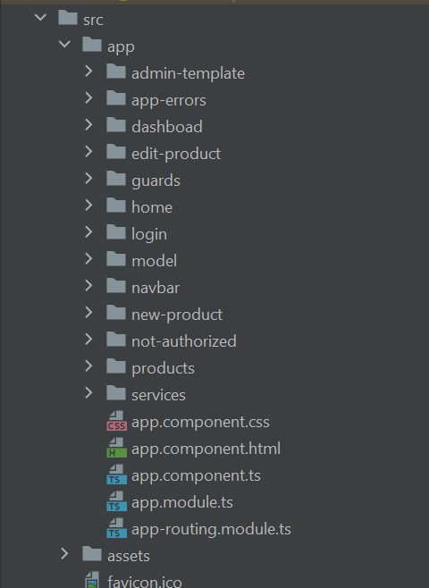
<h3>1. Composants Principaux</h3>
<pre>
// Générer un Composant
ng g c nom-composant
</pre>
<ul>
    <li><strong>NavbarComponent :</strong> La barre de navigation contenant des liens vers différentes sections de
        l'application et des actions utilisateur telles que la connexion et la déconnexion.</li>
    <li><strong>ProductsComponent :</strong> Affiche la liste paginée des produits avec des fonctionnalités de recherche,
        suppression, édition et mise à jour.</li>
    <li><strong>NewProductComponent :</strong> Permet à l'utilisateur d'ajouter un nouveau produit à la liste.</li>
    <li><strong>EditProductComponent :</strong> Fournit un formulaire d'édition pour mettre à jour les détails d'un produit
        existant.</li>
    <li><strong>LoginComponent :</strong> Gère le processus d'authentification de l'utilisateur.</li>
</ul>

<h3>2. Services</h3>
<pre>
// Générer un service
ng g s nom-service
</pre>
<ul>
    <li><strong>AppStateService :</strong> Gère l'état global de l'application, stockant des informations sur les produits
        et l'état d'authentification.</li>
    <li><strong>AuthService :</strong> Gère l'authentification des utilisateurs en vérifiant les informations
        d'identification et en stockant l'état d'authentification.</li>
    <li><strong>ProductService :</strong> Interagit avec la REST API pour effectuer des opérations liées aux produits
        telles que la récupération, la création, la mise à jour et la suppression.</li>
    <li><strong>LoadingService :</strong> Gère l'affichage d'un indicateur de chargement pour informer l'utilisateur lors
        du chargement de données.</li>
</ul>

<h3>3. Guards</h3>
<pre>
// Générer un Guard
ng g g nom-guard
</pre>

<ul>
    <li><strong>AuthenticationGuard :</strong> Protège les routes nécessitant une authentification. Redirige les
        utilisateurs non authentifiés vers la page de connexion.</li>
    <li><strong>AuthorizationGuard :</strong> Protège les routes en fonction des rôles de l'utilisateur. Redirige les
        utilisateurs non autorisés vers une page indiquant qu'ils ne sont pas autorisés.</li>
</ul>

<h3>4. Interceptor</h3>
<pre>
// Générer un intercepteur
ng g interceptor nom-intercepteur
</pre>
<ul>
    <li><strong>AppHttpInterceptor :</strong> Intercepte les requêtes HTTP pour ajouter un en-tête d'autorisation avant
        qu'elles ne soient envoyées au serveur. Il gère également l'affichage d'un indicateur de chargement pendant les
        requêtes.</li>
</ul>

<h2>Data Binding dans l'Application Angular</h2>

    L'un des concepts clés exploités dans l'architecture de notre application est le <strong>data binding</strong>. Le data binding
    d'Angular facilite la synchronisation efficace des données entre les composants et l'interface utilisateur. Nous utilisons
    deux types principaux de data binding :

<ul>
    <li><strong>Data Binding Unidirectionnel :</strong> Utilisé pour afficher des données du modèle vers l'interface utilisateur. Par exemple, dans le composant
        <em>ProductsComponent</em>, le data binding unidirectionnel est utilisé pour afficher la liste paginée des produits.</li>
    <li><strong>Data Binding Bidirectionnel :</strong> Employé pour synchroniser les modifications entre l'interface utilisateur et le modèle. Cela est particulièrement
        utile dans les composants tels que <em>NewProductComponent</em> et <em>EditProductComponent</em>, où les utilisateurs peuvent saisir
        et modifier des données.</li>
</ul>

    En utilisant le data binding, notre application parvient à maintenir une cohérence fluide entre les différentes parties,
    offrant ainsi une expérience utilisateur dynamique et réactive.

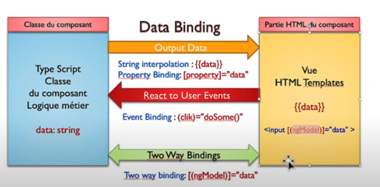

<h2>Observables dans l'Application Angular</h2>

    L'utilisation d'observables joue un rôle essentiel dans notre application Angular, offrant une manière puissante de gérer
    les flux de données asynchrones. Les observables sont employés dans divers aspects de l'application, notamment pour gérer
    les réponses des requêtes HTTP vers le backend de l'API REST et pour mettre en œuvre des fonctionnalités réactives telles
    que la mise à jour dynamique de l'interface utilisateur en temps réel.

    En exploitant les observables, notre application assure une gestion efficace des événements asynchrones, améliorant ainsi
    la réactivité globale et offrant une expérience utilisateur plus fluide.

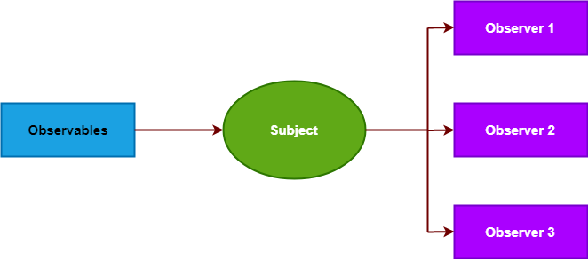
<h2>Fonctionnalités</h2>

<h3>1. Intégrer Bootstrap dans le projet</h3>

<h3>2. Affichage des données statiques</h3>

Dans une première phase, les données sont présentées à l'aide d'une base de données statique, affichée sous forme de tableau.

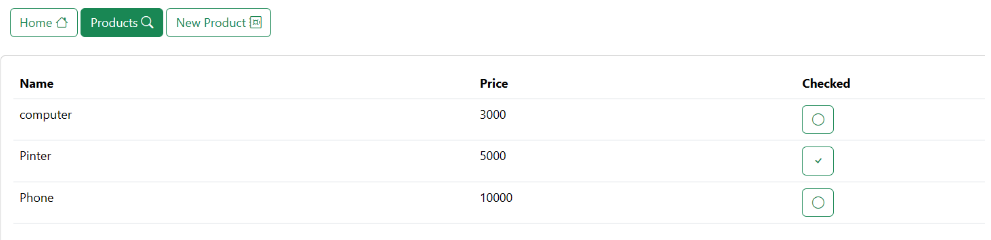

<h3>3. Intégration d'Angular avec une REST API basée sur Json-Server</h3>

L'intégration d'une REST API pour notre application Angular est simplifiée grâce à l'utilisation de JSON Server.

<h4>3.1 Installation de JSON Server</h4>

Tout d'abord, nous devons nous assurer d'avoir JSON Server installé globalement en exécutant la commande suivante dans le terminal :

<pre><code>npm install -g json-server</code></pre>

<h4>3.2 Création du fichier de données (db.json)</h4>

Ensuite, nous créons un fichier de données nommé <strong>db.json</strong> contenant les informations sur nos produits ou d'autres données nécessaires. Nous plaçons ce fichier dans un dossier appelé <strong>data</strong>.

<pre><code>// db.json
{
    "products": [
        // ... données des produits
    ],
    "users": [
        // ... données des utilisateurs
    ]
}</code></pre>

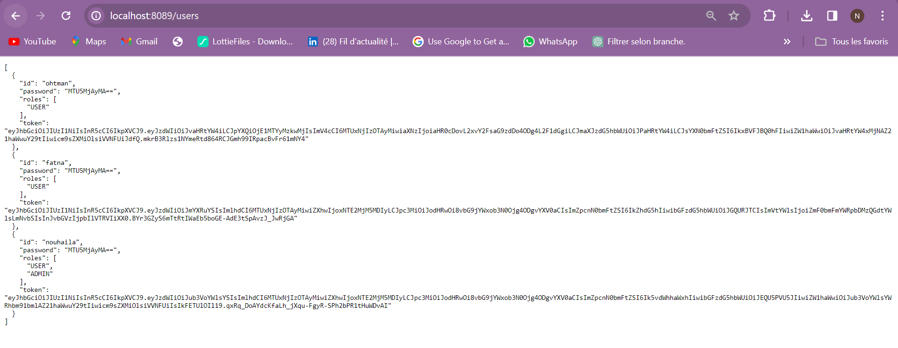

<h4>3.3 Lancement de JSON Server</h4>

Utilisons la commande suivante pour lancer JSON Server en spécifiant le chemin vers notre fichier <strong>db.json</strong> et le port (8089) :

<pre><code>json-server -w data/db.json -p 8089</code></pre>

or
<pre><code>json-server -w data/db.json -p 8089 -H 0.0.0.0</code></pre>

<ul>
<li>L'ajout de l'option -H 0.0.0.0 permet au serveur JSON d'écouter sur toutes les interfaces réseau disponibles. Cela signifie que le serveur JSON peut être accédé depuis d'autres machines du même réseau. C'est utile lorsque vous souhaitez tester votre application sur plusieurs appareils ou partager votre application avec d'autres personnes.
</li>
<li>L'option <strong>-w</strong> est utilisée pour activer le mode de surveillance des fichiers, ce qui est utile lorsque nous souhaitons que JSON Server mette à jour automatiquement les données en fonction des modifications apportées au fichier db.json. Cela démarrera notre serveur API REST sur le port 8089. Nous pouvons personnaliser le port selon nos besoins.</li>
</ul>

<h4>3.4 Communication avec le Backend via des Requêtes HTTP</h4>

    Nous sommes désormais en mesure d'établir des connexions HTTP avec notre backend pour récupérer des données. N'oublions pas d'intégrer le module correspondant
    dans le fichier <strong>app.module.ts</strong> de notre application Angular.

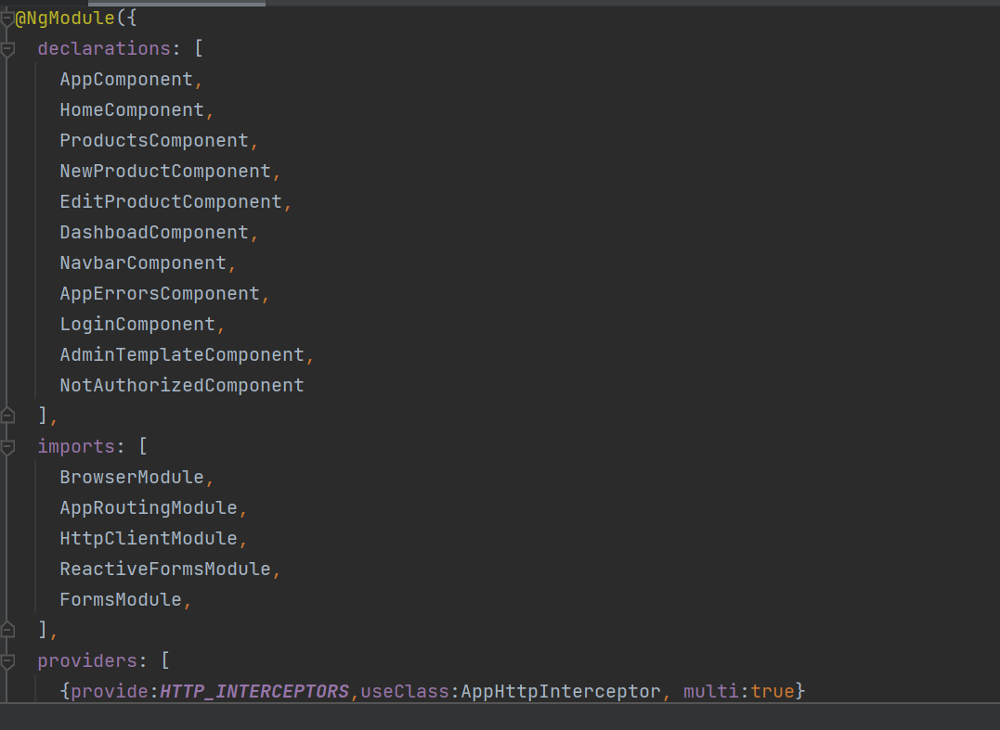

<h2>Captures d'Écran des Pages avec Gestion des Droits d'Accès</h2>

<h3>Génération des Tokens</h3>

<h4>Administrateur</h4>

<h4>Utilisateur</h4>

Ensuite, effectuons l'installation de l'outil Base64 Helper.

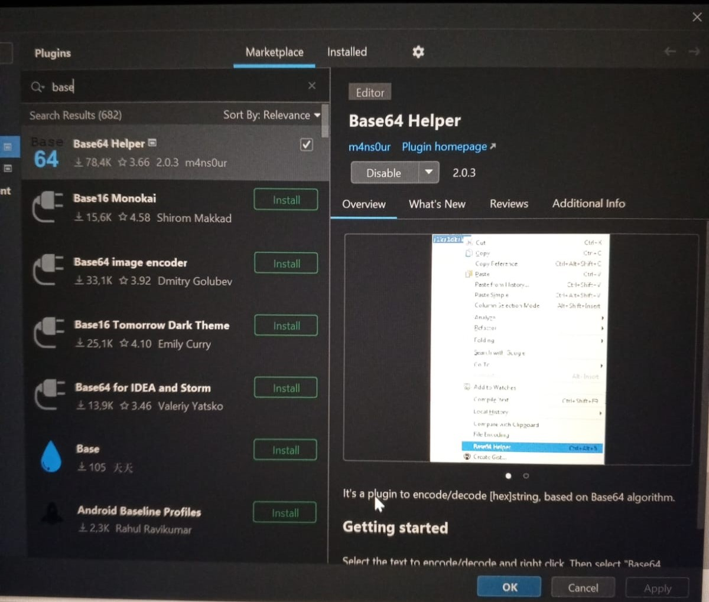

Par la suite, exploitons le Base64 Helper pour encoder les mots de passe.

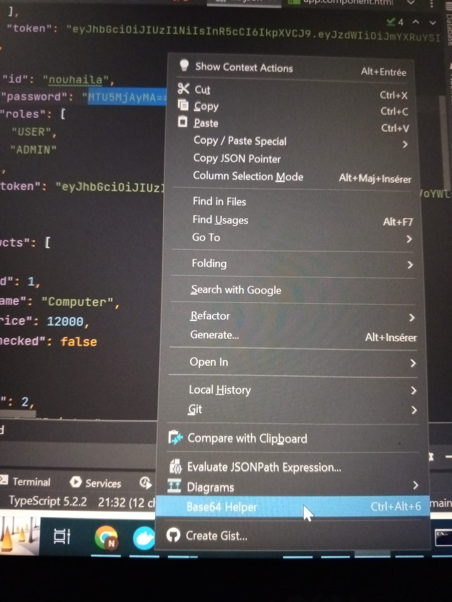
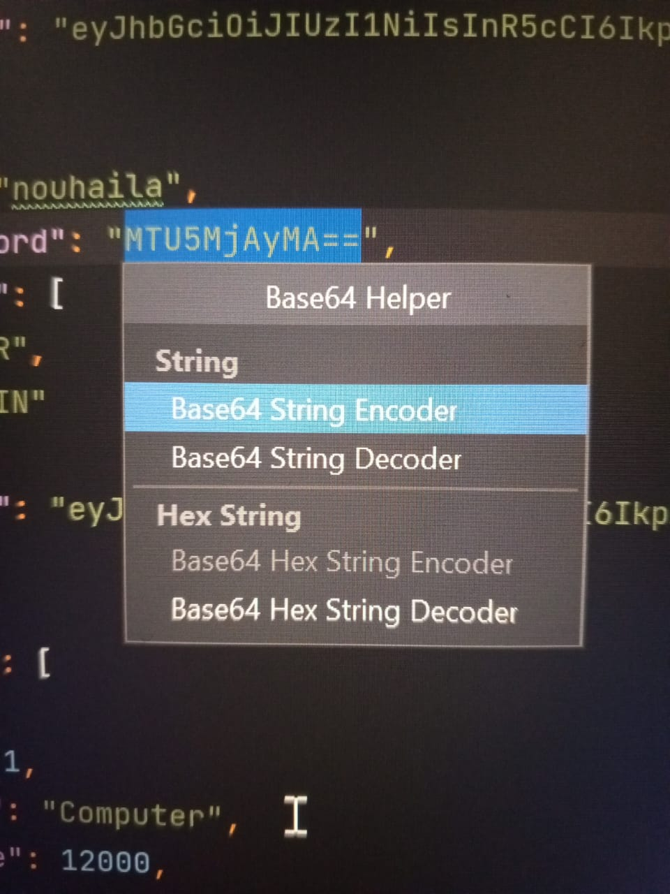

<h2>Pages Accessibles aux Utilisateurs</h2>

<h4>Affichage de la Page d'Authentification</h4>

<h4>Affichage de la Page d'Accueil</h4>

<h4>Affichage des Produits</h4>
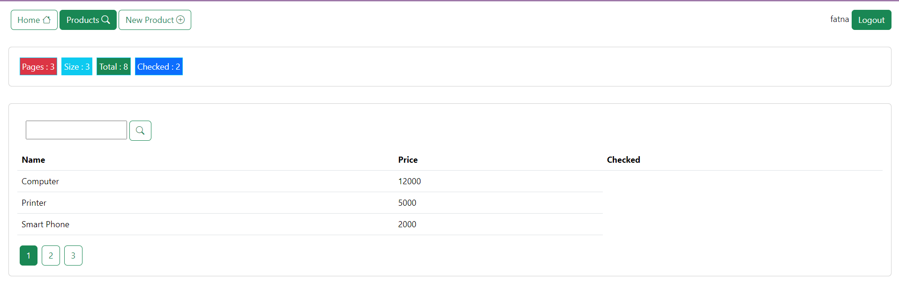

<h4>Recherche des Produits</h4>

<h4>Ajout d'un Produit</h4>
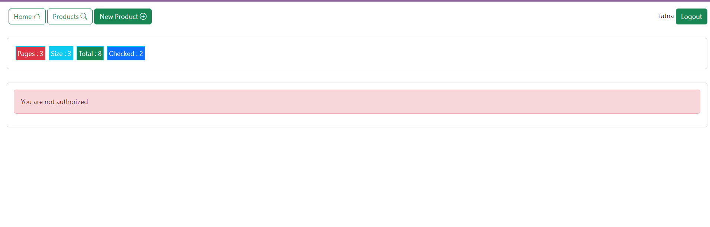

<h2>Pages Accessibles aux Administrateurs</h2>
<h4>Affichage de la Page d'Authentification</h4>

<h4>Affichage de la Page d'Accueil</h4>

<h4>Affichage des Produits</h4>
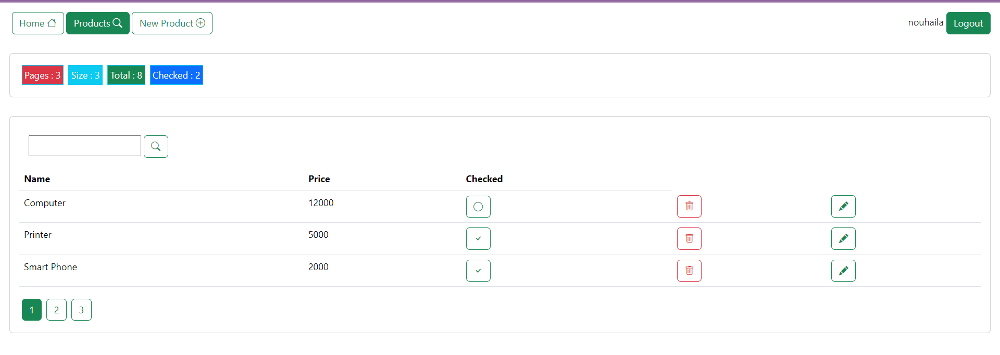

<h4>Recherche des Produits</h4>
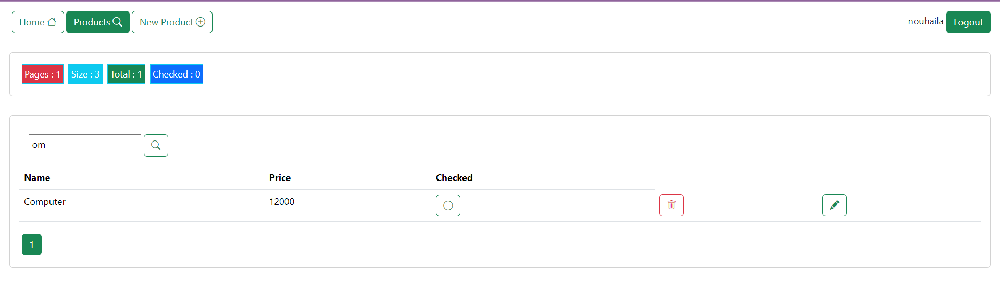

<h4>Ajout d'un Produit</h4>

<h4>Modification d'un Produit</h4>

<h4>Check & Suppression d'un Produit</h4>
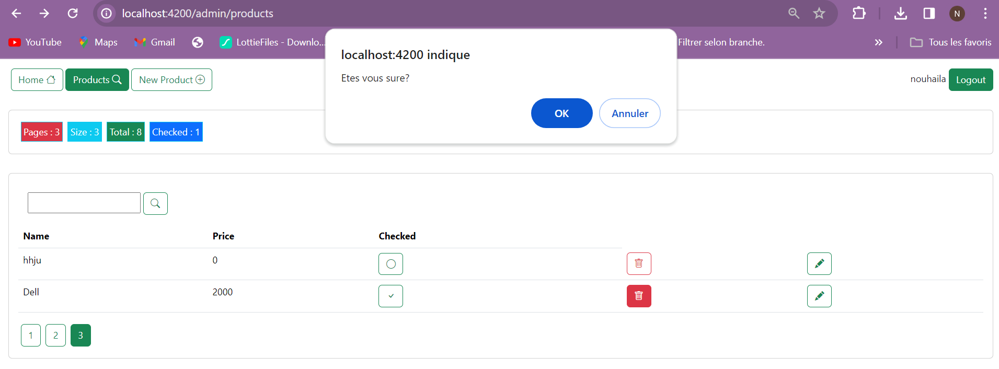

<h2>Conclusion du TP</h2>

  En résumé, ce projet a permis la création d'une application Angular dédiée à la gestion des produits. Les fonctionnalités clés mises en œuvre, telles que l'affichage, la recherche, la pagination, la suppression, l'édition, la mise à jour, l'authentification avec protection des routes, ainsi que la gestion des droits d'accès, fournissent une expérience utilisateur complète. Grâce à une architecture modulaire bien conçue et des services efficaces, l'application garantit une maintenance simplifiée et une évolutivité adaptée à un environnement de développement pratique.

